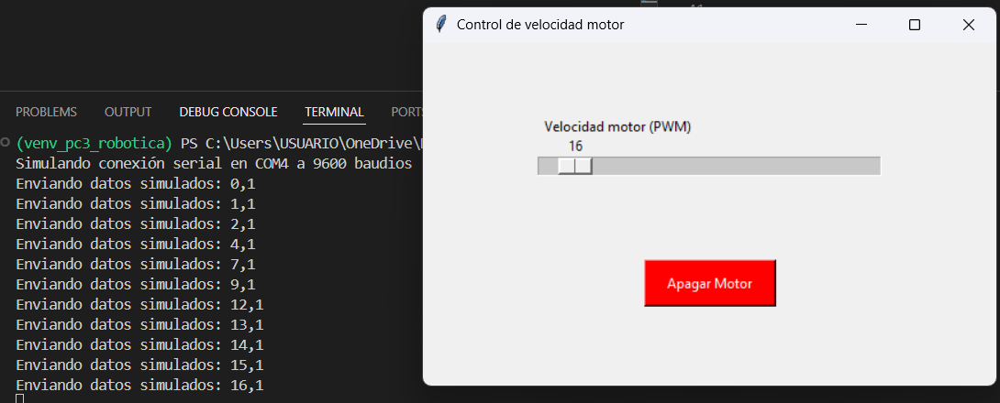

# PC3 Control inteligente de velocidad de motor

**Grupo 1** 
**Control inteligente de velocidad de motor Conecta un motor DC con un módulo L298N al Arduino**. 
Se implementa una interfaz con Tkinter que:

-  Permite ajustar la velocidad del motor mediante un Scale (PWM de 0–255). 
-  Muestrar la velocidad actual en porcentaje. 
-  Incluir un botón de inicio y parada que detenga inmediatamente el motor. 
-  Al  usuario mantener el motor a más del 80% de velocidad durante más de 10 segundos, muestra una alerta visual (roja) en la interfaz. 
- Integrar un gráfico de evolución de velocidad vs. tiempo

L298n es un modulo para manejar motores , sera el puente entre el motor que requiere potencia y el arduino , quien trabaja con voltajes menores.

```bash  
            MÓDULO L298N  
           
        +---------------------------------------+
        |       Disipador negro                 |
MOTOR1  |                                       |         MOTOR2
OUT1+   |⟷                                   ⟷| OUT3   → -
OUT2-   |⟷                                   ⟷| OUT4  →  +
        |---------------------------------------|
        |         |                             |
        |   [J jumper]                          |
        +12V  GND  +5V ENA IN1 IN2 IN3 IN4 ENB 
        +--------------------------------------+
                       ↑ Control (Arduino)
```
Se usara el MOTOR 1 luego se conectara estos bordes de potencia(CAJAS AZULES) al motor DC en cuestión OUT1 y OUT2.En este caso los cables de nuestro motor no tiene polaridad fija entonces los conectamos de forma indistinta. 
Seguidamente la entrada EN1 se conecta al pin 7 del arduino, para  luego hacer lo propio entre la entrada EN2 y el  pin 6 del arduino. De modo que  :
```bash
PIN 6 =1 →→ IN1 = 1 →→ OUT1 =6V 
PIN 7 =0 →→ IN2 = 0 →→ OUT2=GND=0
#obtenemos el giro en un sentido
PIN 6=0 →→  IN1=0  →→  OUT1=GND
PIN 7 =1 →→ IN2=1  →→ OUT2=6V
#obtenemos el giro contrario
```
Ademas si se quiere variar la velocidad conectamos el pin 5(pwm) del arudino al jumper ENA de activacion para el MOTOR1

La bateria por su parte se conecta a los bordes de potencia (CAJAS AZULES) 12V(+) y GND(- referencia electrica "tierra") respectivamente.
Ahora bien como se va a medir potencias tanto arduino como L289n deben tener la misma referencia desde el cual medir dicho voltaje, luego se conecta tanto el negativo de la bateria como el GND del arduino al  GND del l289n.
 
creamos una variable 'arduino' usamos serial.Serial() para la vinculacion con arduino transmitiendo 9600 bit por segundo, usamos modulacion por ancho de banda, para simular un voltaje variable, usaremos para ese fin un pin digiral HIGH-LOW. 

actualizar_valor() define una  funcion interna para la modificacion del valor que sera enviado al arduino via **arduino.write()**

palanca_motor() define una variable global motor_encendido
si este este tiene valor 1 apagamos motor
Caso contrario encendemos
Luego se envia a arduino {valor},{1 ó 0} condificados

seguidamente se crea la **ventana = tk.Tk()**, asignamos un titulo, definimos el tamaño de la ventana.

y el slider dentro de la ventana con los argumentos recomendados, con el **command' = actualizar_valor** , de modo que manipulando el handle modificamos el valor enviado al arduino.
El slider se posiciona via place() quien usa el sistema x y y hacia abajo ,lo posicionamos el el centro  **anchor='center'**

Tambien se crea un **boton_apagar** dentro de ventana y el **command** usado por este es palanca_motor  , que justamente enciende o apaga el motor

La ventana se muestra y al finalizar cerramos el arduino

Para el testeo usamos un mock que simula la conexion serial con arudino UNO.

